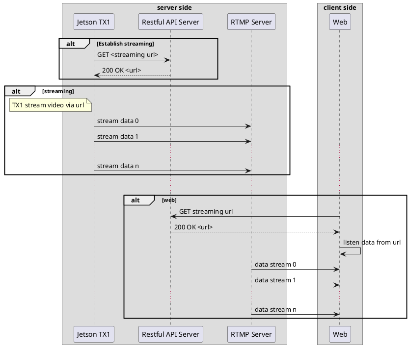

# Overview

## Architecture Design

```plantuml

artifact  "AI Portal" {
    node "Gateway" as gateway
    node "Socket.IO server" as socketio
    node "Restful API server" as restapi
    node "Nginx RTMP Server" as rtmp
    database  Database as db
}

```

## Streaming Video Camera



## Streaming AI

```plantuml
skinparam ParticipantPadding 20
skinparam BoxPadding 30

box streaming data
  participant "Jetson TX1" as tx1
  participant "Socket.IO Srver" as socket
end box

box database
  participant "Database" as db
end box

box server
  participant "Restful API Server" as restapi
  participant "Web" as web
end box

alt stream AI
  tx1 -> socket: Send AI data 0
  socket --> db: insert into ...
  tx1 -> socket: Send AI data 1
  socket --> db: insert into ...
  ...
  tx1 -> socket: Send AI data n
  socket --> db: insert into ...
end

...

web -> restapi: GET statistic data
restapi -> db: aggregate data
db --> restapi: Data
restapi --> web: 200 data
```
